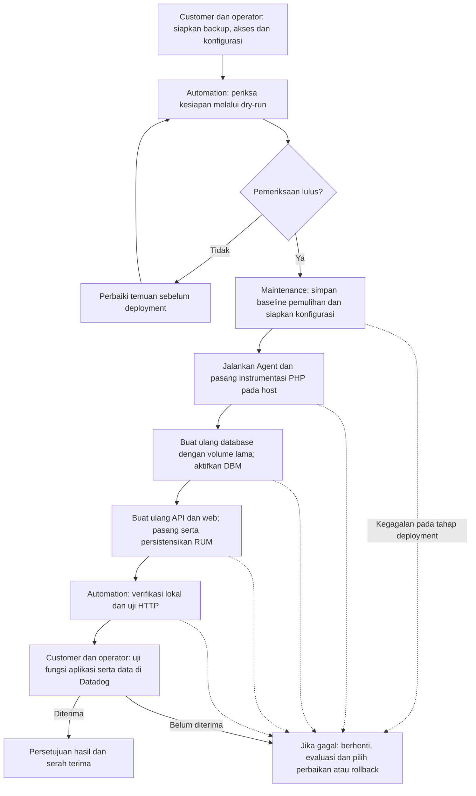

# Penjelasan automation Datadog untuk customer Eminerba

Dokumen ini menjelaskan pekerjaan yang dilakukan automation
`scripts/eminerba-production` pada stack Eminerba di
`/opt/eminerba_docker/docker-compose.yml`. Panduan eksekusi operator tersedia di
[production runbook](PRODUCTION-RUNBOOK.md).

Tujuannya adalah memasang monitoring infrastruktur, log container, penelusuran
request PHP (APM), monitoring MySQL (DBM), dan monitoring pengalaman pengguna
browser (RUM) pada aplikasi yang sudah berjalan. Runtime security, network
monitoring dan Universal Service Monitoring (USM) juga diaktifkan secara default
sebagai cakupan POC, bersama pengumpulan proses.

**Eksekusi deployment membutuhkan maintenance window dan downtime karena
container database, API, dan web akan dibuat ulang.** Volume database yang sudah
ada dipertahankan. Durasi downtime perlu ditentukan dari rehearsal dan kondisi
server; automation tidak menjanjikan durasi tetap.

## Ringkasan alur

## Apa yang dilakukan pada setiap tahap?

| Tahap | Pekerjaan automation | Dampak pada lingkungan customer |
| --- | --- | --- |
| Persiapan (`prepare`) | Membaca container, project dan network yang berjalan; mengambil nama schema dari `DB_NAME`/`DB_NAME2` web; mengunduh skrip installer untuk ditinjau; membuat konfigurasi dan password akun DBM baru | Menulis file persiapan dan mengunduh installer. Belum memasang monitoring atau membuat ulang aplikasi. Customer tetap mengonfirmasi schema API dan mengisi kredensial yang diperlukan |
| Pemeriksaan (`--dry-run`) | Memeriksa konfigurasi, mount, network, schema, kredensial, kepemilikan instalasi monitoring dan checksum installer; membandingkan environment Compose dengan container aktif | Melakukan pembacaan dan connection probe, termasuk akses database. Tidak menjalankan perubahan deployment; hasilnya belum membuktikan keberhasilan instalasi atau telemetry |
| Baseline pemulihan | Mencatat image asli, project, mount dan konfigurasi pemulihan sebelum perubahan; membuat konfigurasi tambahan Compose (overlay) | Menghasilkan file pemulihan dan konfigurasi di host. Metadata ini bukan backup isi database |
| Persiapan image | Memberi tag lokal pada image yang sedang digunakan; bila diperlukan, membangun image turunan web/API untuk menambahkan alat seperti curl, GPG, tar, coreutils dan util-linux | Menggunakan ruang disk dan akses repository paket. Menggunakan image aplikasi yang sedang berjalan sebagai dasar |
| Datadog Agent | Menjalankan Agent terkelola pada network yang sudah ada, dengan akses monitoring host/container, log, socket APM dan koneksi DBM | Menambah container Agent dan konsumsi CPU, RAM, disk serta koneksi keluar ke Datadog |
| Instrumentasi PHP (SSI) | Menjalankan installer pada host dan mengatur runtime Docker `dd-shim`, atau menggunakan instalasi yang sudah sesuai | Mengubah konfigurasi runtime host. Dampaknya perlu ditinjau untuk workload lain pada host yang sama |
| Database Monitoring | Membuat ulang container DB menggunakan volume data yang sama, menambahkan konfigurasi Performance Schema, menunggu SQL siap dan menyiapkan akun/prosedur monitoring | Database berhenti sementara. Ada perubahan konfigurasi MySQL serta objek SQL; rincian ada di bawah |
| Instrumentasi API dan web | Membuat ulang API, lalu web dengan environment tracing, image yang dipilih dan mount socket APM; memeriksa Apache serta URL HTTP | API dan web berhenti sementara selama pergantian container |
| Browser RUM | Memasang modul Apache di web, memeriksa konfigurasi dan melakukan reload; mengekspor aset Apache/modul, memasangnya sebagai mount read-only, lalu membuat ulang web | Web mengalami pergantian container tambahan. File ekspor di host harus dipertahankan agar RUM tetap tersedia setelah recreation |
| Verifikasi lokal | Memeriksa Agent, runtime/tracer, socket, DBM, modul Apache dan endpoint; mengirim GET ke URL yang telah ditentukan | Menghasilkan request uji. URL harus aman untuk GET berulang dan dipilih bersama pemilik aplikasi |

Automation berhenti pada kegagalan pertama. Pemeriksaan menggunakan lock bersama
agar perintah deployment dari paket ini tidak berjalan bersamaan; pekerjaan
Docker/Compose dari luar paket tetap perlu dikoordinasikan oleh operator.

## Perubahan pada database

Automation mempertahankan sumber volume data MySQL dan memeriksa kecocokannya
saat deployment. Konfigurasi monitoring ditambahkan melalui file terpisah di
`/etc/mysql/conf.d/zz-datadog.cnf` untuk mengaktifkan Performance Schema dan
pengumpulan informasi statement/query.

Dengan kredensial administrator yang disediakan, automation:

- Membuat akun monitoring jika belum ada, dengan batas lima koneksi. Akun yang
  sudah ada harus sesuai; password akun lama tidak dirotasi otomatis.
- Memberikan hak `PROCESS`, `REPLICATION CLIENT`, pembacaan
  `performance_schema` dan `mysql.innodb_index_stats`, serta `EXECUTE` pada
  prosedur monitoring yang ditentukan.
- Membuat schema `datadog` bila belum ada, prosedur `explain_statement` pada
  schema monitoring dan schema aplikasi yang dikonfigurasi, serta prosedur
  pengaktifan consumer di schema `datadog`.
- Memeriksa prosedur yang sudah ada dan menghentikan proses jika definisinya
  berbeda atau tidak dapat diverifikasi. Prosedur memakai `SQL SECURITY DEFINER`,
  sehingga DBA perlu meninjau dan mempertahankan akun definer yang digunakan.

Paket tidak memberikan hak `SELECT` langsung atas tabel bisnis kepada akun DBM.
Namun, informasi query dan aktivitas database termasuk cakupan monitoring yang
harus ditinjau DBA. Perubahan SQL tidak bersifat transaksional; kegagalan dapat
meninggalkan sebagian objek yang sudah dibuat.

## Data monitoring dan akses yang digunakan

| Komponen | Cakupan yang perlu diketahui customer |
| --- | --- |
| Infrastructure dan proses | Metrik host/container; pengumpulan proses aktif secara default |
| Logs | Pengumpulan log container, dengan Agent sendiri dikecualikan. Isi log mengikuti apa yang ditulis aplikasi |
| APM | Trace request PHP dan span database sesuai instrumentasi, konfigurasi dan sampling |
| DBM | Metrik MySQL, informasi query dan sampel query sesuai konfigurasi |
| RUM | Informasi sesi, halaman dan resource browser sesuai konfigurasi aplikasi RUM |
| Runtime security | Aktif secara default untuk POC; mengumpulkan informasi keamanan runtime workload |
| Network monitoring | Aktif secara default untuk POC; memantau koneksi dan lalu lintas jaringan workload |
| Universal Service Monitoring (USM) | Aktif secara default untuk POC; mengamati layanan melalui system-probe, melengkapi tracing PHP |

Ketiga fitur tersebut dikonfigurasi pada Agent saat deployment. Persiapan POC
mencakup pengecekan kernel/eBPF, akses host, kapasitas dan ketersediaan layanan
Datadog terkait. Agent menggunakan mount host dan capability tambahan sesuai
konfigurasi fitur. Keberhasilan POC harus dibuktikan dengan kesehatan komponen
dan data runtime security, koneksi jaringan, layanan USM serta proses yang terlihat
di Datadog; flag aktif saja belum membuktikan fitur berfungsi.

Default ini berlaku untuk konfigurasi baru. Konfigurasi lama dengan nilai
`false` perlu diperbarui oleh operator. Jika Agent sudah terpasang, perubahan
spesifikasinya mengikuti prosedur migrasi Agent pada runbook; deployment tidak
mengganti Agent yang sudah ada secara otomatis.

Agent mengirim telemetry ke site Datadog yang dikonfigurasi; browser memerlukan
akses ke layanan RUM terkait. Customer perlu menyepakati cakupan data, sampling,
retensi pada layanan Datadog, serta dampak biaya sebelum maintenance. Log/query
dapat memuat informasi sensitif sesuai perilaku aplikasi.

Eksekusi memerlukan akses sudo/root, Docker dan administrator MySQL. Kredensial
disimpan dalam file privat pada host; administrator host/Docker tetap memiliki
kemampuan mengaksesnya. Agent menggunakan network internal dan socket APM tanpa
menambah port publik host untuk Agent. File ekspor Apache dapat memuat konfigurasi
sensitif dan perlu disimpan dengan akses terbatas.

## Batas pekerjaan automation

Paket tidak mengubah source PHP, driver CodeIgniter, kredensial database aplikasi,
Dockerfile customer, `.env`, atau file Compose utama. Perubahan deployment
diterapkan melalui overlay yang dihasilkan. Paket tidak menjalankan upgrade
MySQL, `docker compose down`, penghapusan volume, atau pruning.

Backup database yang konsisten dan pengujian restore disediakan oleh customer/DBA.
Tag image dan `recovery.json` hanya membantu pemulihan deployment. Perubahan yang
hanya tersimpan di writable layer container perlu diekspor sebelum recreation.

Automation tidak membuktikan login, transaksi bisnis, sesi dan upload berfungsi
benar. Pemeriksaan HTTP lokal juga belum membuktikan data telah diterima Datadog
atau hubungan RUM–APM–DBM berhasil. Pengaturan browser seperti Allowed Tracing
URLs, sampling, CSP dan CORS tetap perlu dikonfirmasi bersama pemilik aplikasi.

## Jika deployment gagal

Automation menampilkan tahap gagal dan mencatat status ketika pencatatan tahap
sudah aktif. **Rollback tidak berjalan otomatis.** Operator meninjau penyebab
dan menentukan apakah akan memperbaiki lalu mengulang deployment, atau menjalankan
rollback saat maintenance.

Rollback aplikasi membutuhkan metadata pemulihan, image asli lokal, Compose/`.env`
yang sesuai, mount/data volume yang masih tersedia dan akses administrator SQL.
Prosesnya membuat ulang DB, lalu API/web menggunakan image asli dan runtime
`runc`, menonaktifkan tracing serta melepas mount monitoring tambahan.
Isi database terkini tetap dipertahankan; rollback ini tidak mengembalikan
transaksi database ke waktu sebelumnya.

Agent, SSI pada host, objek/hak SQL DBM dan pengaturan di Datadog tetap ada setelah
rollback aplikasi. Pemulihan komponen tersebut mengikuti
[panduan rollback komponen](ROLLBACK.md). Jika Docker tidak dapat berjalan atau
artefak pemulihan hilang, diperlukan prosedur pemulihan host/backup yang disepakati.

## Yang perlu disiapkan dan disetujui customer

| Waktu | Kebutuhan customer bersama operator |
| --- | --- |
| Sebelum maintenance | Konfirmasi aplikasi sehat, scope host/service/schema, backup dan bukti restore, akses, konfigurasi Datadog, endpoint GET aman, kapasitas, downtime, pemilik recovery dan kriteria rollback |
| Saat maintenance | Ketersediaan pemilik aplikasi, DBA dan platform untuk menangani temuan; jeda deployment lain dan perubahan Docker/Compose pada host |
| Setelah deployment | Uji login, request bisnis, API, sesi dan upload; bandingkan error/latency/resource dengan baseline; periksa telemetry serta korelasi RUM–APM–DBM di Datadog |
| Serah terima | Catat revisi kode, versi komponen, hasil uji, lokasi artefak recovery dan keputusan penerimaan; tentukan penanggung jawab serta periode retensi |

Operasi Compose berikutnya perlu menyertakan
`/opt/eminerba-observability/generated/production.override.json` dan mempertahankan
direktori ekspor RUM yang dipakai sebagai mount. Upgrade aplikasi atau perubahan
konfigurasi memerlukan peninjauan image yang dipin, overlay dan aset Apache.
Setelah rollback, gunakan overlay rollback sesuai runbook.

Penjelasan ini mengikuti implementasi pada
[coordinator produksi](../scripts/eminerba_production.py),
[deployment komponen](../scripts/datadog_deploy.py), dan
[pemulihan aplikasi](../scripts/eminerba_recovery.py). Bukti penerimaan dicatat
mengikuti [production runbook](PRODUCTION-RUNBOOK.md#keep-these-files-and-record-the-result).
