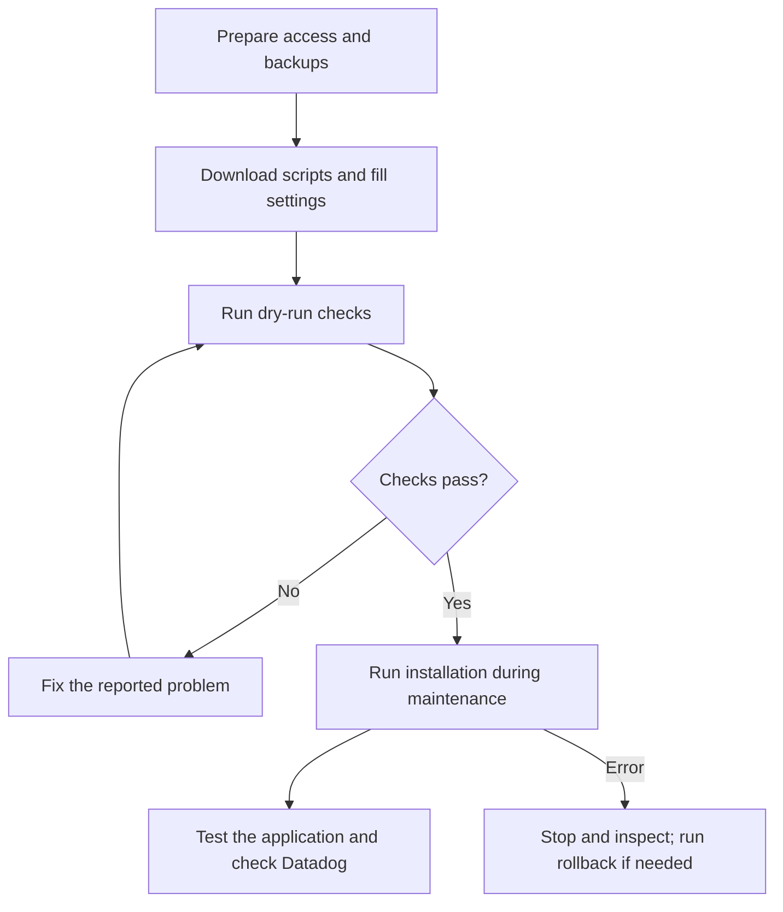

# Eminerba: production deployment guide

Updated: 29 September 2026.

Use this guide to add Datadog monitoring to the existing production application.
Run one step at a time. If a command fails, stop and read the error before continuing.

**The website, API and database will stop briefly during installation. Agree on a
maintenance time with the customer first. Rollback is available, but you must run it yourself.**

The process is:



## 1. Before you start

Confirm these items with the server and application teams:

- [ ] The server uses Ubuntu 22.04 or 24.04, and you have SSH and `sudo` access.
- [ ] Docker and Compose work on this server. The application uses Apache/PHP 8.1 and MySQL 8.0.
- [ ] The production website, API and database already work normally.
- [ ] A recent database backup is available, and the database team knows how to restore it.
- [ ] Application files, uploads and configuration are backed up. Keep the current Docker images for rollback.
- [ ] There is enough free RAM and disk space for monitoring and image preparation.
- [ ] No other deployment or Docker changes will run at the same time.
- [ ] The server can download packages and send data to Datadog over HTTPS. Users' browsers can also reach Datadog.
- [ ] Someone from the application/database team is available if a check fails.

The monitoring setup changes Docker settings on the host. Ask the server team to
check its effect on any other applications on the same server. Also confirm that
important files are not stored only inside a container: replacing that container
can remove those files.

Have these values ready:

| What you need | Where to get it |
| --- | --- |
| Datadog API key and site | Datadog administrator |
| Approved Datadog Agent version | Monitoring team; use an exact `7.X.Y` version, at least `7.76.1` |
| Production RUM application ID, client token and remote configuration ID | Production RUM application settings for Apache auto-instrumentation |
| Existing MySQL admin username and password | Database administrator |
| Actual database names used by web and API | Application/database team |
| A website URL and an API URL to test | Application team; requests must not change data |

The MySQL admin account needs permission to create the monitoring account and
database monitoring settings. If the database team must run SQL separately, use
the [staged deployment guide](DEPLOYMENT.md) instead.

## 2. Download the deployment scripts

First, install any missing basic tools through the customer's normal change process:

```bash
sudo apt-get update
sudo apt-get install -y git python3 bash curl ca-certificates tar gzip \
  coreutils util-linux nano less
```

**Clone the repository outside `/opt/eminerba_docker`.** Use your home directory:

```bash
cd ~
git clone https://github.com/avecenabasuni/datadog-deployment-1.git
cd datadog-deployment-1
```

If you already cloned it, use this instead:

```bash
cd ~/datadog-deployment-1
git pull --ff-only origin main
```

Check and record the version you will use:

```bash
git log -1 --oneline
```

If logged in as `root`, the folders are:

| Folder | Purpose |
| --- | --- |
| `/root/datadog-deployment-1/` | Deployment scripts and your Datadog settings |
| `/opt/eminerba_docker/` | Existing production application |
| `/opt/eminerba-observability/` | Files created by the monitoring setup |

Run all commands below from `~/datadog-deployment-1`.
The script automatically uses `/opt/eminerba_docker/docker-compose.yml`.
You do not need to move the application or replace its Dockerfile.

## 3. Check the server and application

Check Docker, Compose and the containers:

```bash
python3 --version
sudo docker info --format 'Docker={{.ServerVersion}} Runtime={{.DefaultRuntime}}'
sudo bash scripts/compose version
sudo docker ps -a --format '{{.Names}} | {{.Status}}'
```

**Expected:** Python 3.8 or later, working Docker/Compose, and these containers
with status `Up`:

| Container | Purpose |
| --- | --- |
| `eminerba_web` | Website |
| `eminerba_api` | API |
| `eminerba_db` | MySQL database |

If a container is missing or stopped, ask the application team to restore it first.
**Do not run lab `prepare` or `repair` commands on production.**

The scripts support both `docker compose` and `docker-compose` automatically.
Only if using the older `docker-compose`, also install:

```bash
sudo apt-get install -y python3-yaml
```

Do not reinstall or upgrade the production Docker Engine as part of these steps.
The script requires Docker running locally on this host with administrator access.

Record where the existing database data is stored. Save this output for comparison later:

```bash
sudo docker inspect eminerba_db \
  --format '{{range .Mounts}}{{println .Type .Name .Source "->" .Destination}}{{end}}'
```

If Datadog is already installed on the host or in another container, ask the
monitoring team to check it before proceeding. The script will not silently
replace an existing Agent that it does not manage.

## 4. Create the production settings files

Run once:

```bash
sudo bash scripts/eminerba-production prepare
```

This checks the existing application, downloads the installers and creates:

| File | Purpose |
| --- | --- |
| `config/eminerba.json` | Monitoring settings |
| `config/eminerba-secrets.json` | API key and database passwords |

**Expected:** a `Prepared ...` message with both file paths. This step does not
install monitoring or replace application containers.

If it says **configuration already exists**, keep the files and review them in
step 5. Do not delete them to generate new passwords. If only one file exists,
stop and check the earlier preparation error.

## 5. Fill in the settings

Open the main settings file:

```bash
sudo nano config/eminerba.json
```

Fill or confirm these values. Ask the team listed in step 1 if a value is unknown.

| Field | What to enter |
| --- | --- |
| `agent_image` | `registry.datadoghq.com/agent:7.X.Y`; replace `X.Y` with the approved version. Do not use `latest` |
| `site` | Your organization's Datadog site, for example `datadoghq.com` |
| `version` | The production application's release number |
| `mysql_schemas` | A list of existing application database names; check both web and API databases |
| `db_apps` | Keep `["web", "api"]` if both use MySQL; otherwise select only the service that does |
| `rum_application_id` | Production RUM application ID |
| `rum_client_token` | Client token from that RUM application |
| `rum_remote_configuration_id` | Remote configuration ID from the same Apache RUM setup |
| `rum_url` | Optional: a website page that returns HTML; leave empty or omit to skip web HTTP readiness and RUM injection smoke checks |
| `apm_url` | Optional: an API request that reads data from MySQL; leave empty or omit to skip API HTTP readiness and smoke checks |
| `ssi_sha256`, `rum_sha256` | File checksums from step 6 |

For this stack, web uses host port **81** and API uses host port **80**.
If configuring test URLs, use the correct application paths or public domain names.
Each configured URL must work from the server without login, extra headers or
redirects. Do not use a request that creates, updates or deletes data, or put
passwords in a URL. Both URLs are optional and independent; empty, omitted or
`null` values skip their respective HTTP checks during deployment and rollback.
Replace any old URL placeholders with real URLs or empty strings. Container
listener checks and local observability verification still run. When HTTP checks
are skipped, validate application requests, RUM injection and telemetry manually.

Keep generated paths, container names and `env: "prod"` unless the team has
reviewed a change. Use real production database names, not the lab database names.

### Monitoring features for this POC

These four settings must be `true` for the current POC:

| Setting | What it monitors |
| --- | --- |
| `process_collection` | Running processes |
| `runtime_security` | Security activity on the server and containers |
| `network_monitoring` | Network connections |
| `universal_service_monitoring` | Services detected from network traffic; also called USM |

New settings files already use these defaults. Old files keep their previous
values. The server team must confirm that these features are supported and have
enough resources and access.

If monitoring is already deployed, **do not just change the flags and rerun**.
Ask the monitoring team to follow the [Agent change procedure](ROLLBACK.md#agent).
Keep the existing recovery files; the script may refuse changes to an existing Agent.

### Passwords and API key

```bash
sudo nano config/eminerba-secrets.json
```

| Field | What to enter |
| --- | --- |
| `api_key` | Production Datadog API key |
| `admin_password` | Existing MySQL admin password; default admin username is `root` |
| `db_password` | Keep the generated password for the new monitoring account. If that account already exists, use its current password |

Do not change the application's database password. Do not share this file in chat,
tickets or Git. In nano, save with `Ctrl+O`, press Enter, then exit with `Ctrl+X`.

Protect the files and check their JSON syntax:

```bash
sudo chmod 600 config/eminerba.json config/eminerba-secrets.json
sudo python3 -m json.tool config/eminerba.json >/dev/null
sudo python3 -m json.tool config/eminerba-secrets.json >/dev/null
```

**Expected:** no output and no error. If a check fails, fix the reported line first.

## 6. Check the installer files

Ask the technical team to review the downloaded installers, including any files
they download. Do not run these installers manually; the deployment command does that.

```bash
sudo less /opt/eminerba-observability/artifacts/ssi.sh
sudo less /opt/eminerba-observability/artifacts/rum.sh
```

Press `q` to exit each file. After review, get their checksums:

```bash
sudo sha256sum /opt/eminerba-observability/artifacts/ssi.sh \
  /opt/eminerba-observability/artifacts/rum.sh
```

A checksum is a code used to detect changes to a file. Copy the long value shown
for `ssi.sh` into `ssi_sha256`, and the value for `rum.sh` into `rum_sha256`:

```bash
sudo nano config/eminerba.json
```

These checksums cover the two installer files, not everything they later download.
If the files are missing, use the fetch command in [Common problems](#common-problems).

## 7. Check readiness with dry-run

```bash
sudo bash scripts/eminerba-production --dry-run
```

Dry-run checks the existing application, database, settings and installer files.
It does not install monitoring or replace containers.

**Expected:** a deployment plan and a message that no deployment changes were made.

**If it fails:** fix the reported problem and repeat this step. Continue to
installation only after dry-run passes. Passing dry-run does not prove that all
installation steps will succeed.

## 8. Install during maintenance

Confirm the customer is ready for downtime and the backup is available. Then run:

```bash
sudo bash scripts/eminerba-production --maintenance
```

The script automatically:

1. Saves information needed for application rollback.
2. Starts the Datadog Agent, which collects and sends monitoring data.
3. Sets up PHP request monitoring on the Docker host.
4. Replaces the database container using its existing data storage and adds monitoring settings.
5. Replaces the API and web containers with monitoring enabled.
6. Adds browser monitoring and checks that it survives web container replacement.
7. Runs local application and monitoring checks.

Keep the session open and wait for the command to finish. Some steps take several minutes.

**Expected:**

```text
[OK   ] Local deployment checks passed.
```

If an error appears, stop and follow [If installation fails](#if-installation-fails).
Do not rerun installation repeatedly without checking the cause.

## 9. Test the application and check Datadog

### Check the server

```bash
sudo docker ps --format '{{.Names}} | {{.Status}}'
sudo docker exec eminerba-agent agent health
```

**Expected:** web, API, database and `eminerba-agent` are running; Agent health passes.

Check database storage again. Its data source must match the record from step 3:

```bash
sudo docker inspect eminerba_db \
  --format '{{range .Mounts}}{{println .Type .Name .Source "->" .Destination}}{{end}}'
```

To repeat the automated checks without reinstalling:

```bash
sudo bash scripts/datadog-bootstrap verify \
  --config config/eminerba.json \
  --secrets config/eminerba-secrets.json

sudo bash scripts/datadog-bootstrap smoke \
  --config config/eminerba.json \
  --secrets config/eminerba-secrets.json
```

`verify` checks monitoring components. `smoke` sends requests to your two test URLs.
Both commands should finish without errors.

### Check the website and monitoring data

Ask the application owner to test login, normal page access and an API request
that reads database data. Confirm existing uploads and user sessions still work.

Open the application in a browser and make a few read-only requests. In Datadog,
filter server/application data by `env:prod` and check:

| Check | What you should see |
| --- | --- |
| Infrastructure and logs | Server/container information and application logs |
| APM: application request monitoring | Website/API requests and their database calls |
| DBM: database monitoring | The correct MySQL instance and query information |
| RUM: browser monitoring | Browser sessions, pages and requests for the production RUM application |
| Links between products | A browser request links to its application trace, and database calls link to DBM data |
| POC features | Process, security, network and USM data are available |

The monitoring team must set RUM **Allowed Tracing URLs** to the API URLs used
by the browser and confirm production tags. If the links do not appear, ask the
team to check browser settings, request headers and the application's database driver.

**A successful command is not the final test.** Confirm both application behavior
and data in Datadog. Record any missing result and compare server load and application
errors with the values before installation. Use the [detailed checklist](VALIDATION.md)
if the team needs more technical checks.

## If installation fails

Read the log lines:

| Label | Meaning |
| --- | --- |
| `STEP` | Current task |
| `ERROR` / `DETAIL` | What failed and the available error details |
| `NEXT` | Suggested next action |
| `STOP` | The script stopped; it did not run rollback automatically |

You can also check the last saved status:

```bash
sudo cat /opt/eminerba-observability/generated/deployment-status.json
```

This file may be missing after an early failure. Check its time: it may belong
to an older run. A status of `running` after a lost connection is not proof of success.
Ask the operator to check whether installation is still active before starting another command.

### Return the application containers to their previous setup

This is called **rollback**. Use it when the team decides to undo the container
changes. First check that recovery is possible:

```bash
sudo bash scripts/eminerba-production rollback --dry-run
```

Only if that check passes, run during maintenance:

```bash
sudo bash scripts/eminerba-production rollback --maintenance
```

**Expected:** `APPLICATION ROLLBACK COMPLETED`. Test the website and API again.

Rollback uses the saved original images and the existing database storage.
It keeps current database data; it does not restore an older database backup.
It leaves the Datadog Agent, host monitoring software and database monitoring
accounts/settings in place.

Rollback needs the saved `recovery.json`, original Docker images, application
settings and database storage. If anything is missing, stop and involve the
server/database team. Do not create an empty database or delete saved settings
to make the check pass. See [full recovery instructions](ROLLBACK.md).

After fixing the cause, deployment can be tried again: run step 7 first, then
step 8 during maintenance. Repeat the tests in step 9.

## Common problems

| Message or problem | What to do |
| --- | --- |
| `no such object: eminerba_web` | The container is missing. Ask the application team to restore it; do not use lab setup commands |
| `Application schema not found` | Check `mysql_schemas` with the database team. A schema means a database name here |
| MySQL `Access denied` | Check the saved username/password and account permissions with the database team |
| MySQL `ERROR 2061`, `caching_sha2_password`, `Authentication requires secure connection` | Update the deployment scripts and retry dry-run. Local TCP probes request the server's RSA public key when needed. If this persists, ask the database team to check server RSA keys and TLS settings |
| Configuration already exists | Review the existing files in step 5; do not generate new passwords |
| Another deployment is active | Wait for that run or ask its operator. Do not delete the lock file |
| Checksum mismatch | Review the installer file with the technical team before changing the saved checksum |
| Compose, environment or mount mismatch | Application settings/storage differ from what the script expects. Ask the application/server team to compare them |
| Existing Agent or Agent settings changed | Use the [Agent change procedure](ROLLBACK.md#agent); do not install a second Agent |
| MySQL settings still show `1024` | Ask the server team to check the added MySQL config file, its read permission and whether MySQL loaded it |
| Readiness timeout, missing RUM flag or Apache error | Keep the full error message. Ask the technical team to check the failed component before retrying |
| Commands pass, but Datadog has no data | Check the site, API key, network access and whether real requests were sent |

If settings files exist but the installers are missing, download them again:

```bash
sudo bash scripts/datadog-bootstrap fetch-installers \
  --config config/eminerba.json \
  --secrets config/eminerba-secrets.json
```

Then repeat step 6. This command keeps installer files that already exist.
Before sharing logs, remove passwords, API keys and customer data.

## Keep these files and record the result

Keep these items after installation:

- `config/eminerba.json` and `config/eminerba-secrets.json`.
- `/opt/eminerba-observability/`, including recovery files and exported web configuration.
- The original Docker images and the customer's application/database backups.

**Future container changes must include the generated
`/opt/eminerba-observability/generated/production.override.json`.** This extra
Compose file contains the monitoring settings. Using only the original Compose
file can remove monitoring. After rollback, use `rollback.override.json` instead;
do not combine both files. See the [production overview](EMINERBA-PRODUCTION.md#subsequent-deployments-and-failures)
for details before an application upgrade.

Do not delete database volumes or run `down -v` as a cleanup step. Do not delete
monitoring files or change API keys/settings to bypass an error.

Record the operator, date, repository version, backup location, deployment result
and the application/Datadog test results. List any unfinished checks and who will
handle them. The team's reported lab success is useful evidence, but production
still needs its own test results.

## More detail, when needed

- [Technical production overview](EMINERBA-PRODUCTION.md)
- [Detailed validation checklist](VALIDATION.md)
- [Rollback and component recovery](ROLLBACK.md)
- [Automation explanation for the customer, in Indonesian](AUTOMATION-CUSTOMER.md)
- [Test results](LOCAL-TESTS.md)

The original guide was checked using Context7 and official Docker/Datadog
documentation. This revision simplifies the wording; deployment commands and
script behavior are unchanged.
